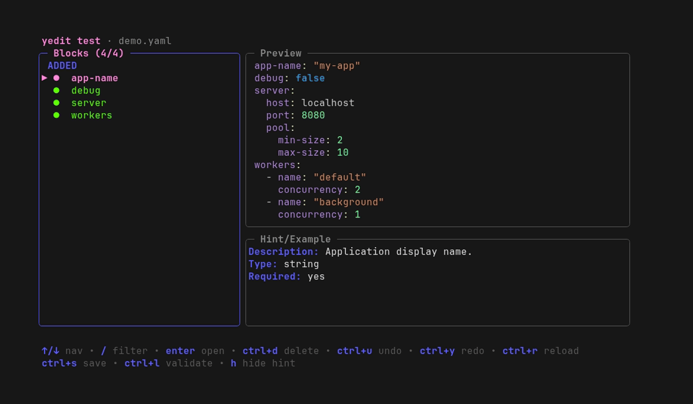

<!-- markdownlint-disable MD033 -->
<p align="center">
  
</p>
<!-- markdownlint-enable MD033 -->


A TUI YAML editor library for Go applications, built on [bubbletea](https://github.com/charmbracelet/bubbletea). Drop it into any CLI tool to give users a structured, schema-aware editor for their configuration files.

## What it does

- Can be embedded in any Go CLI tool, or used as a standalone editor for YAML files.
- Schema is defined by a Go struct and a metadata tree, so you can use the same schema for validation, doc generation, and editor behavior.
- Opens a YAML file in a split-pane TUI: block list on the left, YAML editor on the right.
- Supports editing of nested structs, lists, and maps with a tree view and a `[N]` navigator.
- Handles self-referential (recursive) struct types, with a configurable expansion depth.
- Lets you hide fields from the UI or pass them through untouched, without changing your Go struct.
- Displays per-field hints, types, defaults, and examples in a side panel.
- Validates the YAML on save with a declarative rule set.
- Flags unknown keys that aren't part of your schema.
- Supports presets, two-level undo/redo, nested drill-in editing, and theming.
- Generates Markdown reference docs and a TUI doc browser from your schema.

## Install

```sh
go get github.com/lucasassuncao/yedit
```

## Minimal example

### Recommended: implement `Metadata()` on your struct

Each struct declares only its own direct fields; nested structs that also implement `MetadataProvider` are composed automatically.

```go
package main

import (
	"log"

	"github.com/lucasassuncao/yedit/editor"
	"github.com/lucasassuncao/yedit/metadata"
)

type ServerConfig struct {
	Host string `yaml:"host"`
	Port int    `yaml:"port"`
}

func (ServerConfig) Metadata() map[string]*metadata.Node {
	return map[string]*metadata.Node{
		"host": {FieldMeta: editor.FieldMeta{Description: "Address to bind.", Default: "localhost"}},
		"port": {FieldMeta: editor.FieldMeta{Description: "Port to listen on.", Default: "8080"}},
	}
}

type Config struct {
	Server ServerConfig `yaml:"server"`
}

func (Config) Metadata() map[string]*metadata.Node {
	return map[string]*metadata.Node{
		"server": {FieldMeta: editor.FieldMeta{Description: "HTTP server configuration."}},
		// no Children needed - ServerConfig.Metadata() is composed automatically
	}
}

func main() {
	src, err := metadata.New(Config{})
	if err != nil {
		log.Fatal(err)
	}

	if _, err := editor.Run(editor.Config{
		Path:        "config.yaml",
		Schema:      &Config{},
		Metadata:    src,
		EnableHints: true,
	}); err != nil {
		log.Fatal(err)
	}
}
```

### Escape hatch: `metadata.NewFromTree` for structs you don't own

Use this when the root struct comes from a third-party package and can't implement `Metadata()`. You assemble the full tree manually and pass it alongside the struct pointer.

```go
package main

import (
	"log"

	"github.com/lucasassuncao/yedit/editor"
	"github.com/lucasassuncao/yedit/metadata"
)

type Config struct {
	Server struct {
		Host string `yaml:"host"`
		Port int    `yaml:"port"`
	} `yaml:"server"`
}

func main() {
	src, err := metadata.NewFromTree(&Config{}, map[string]*metadata.Node{
		"server": {
			Children: map[string]*metadata.Node{
				"host": {FieldMeta: editor.FieldMeta{Description: "Address to bind.", Default: "localhost"}},
				"port": {FieldMeta: editor.FieldMeta{Description: "Port to listen on.", Default: "8080"}},
			},
		},
	})
	if err != nil {
		log.Fatal(err)
	}

	if _, err := editor.Run(editor.Config{
		Path:        "config.yaml",
		Schema:      &Config{},
		Metadata:    src,
		EnableHints: true,
	}); err != nil {
		log.Fatal(err)
	}
}
```

## Documentation

| Document | Contents |
|---|---|
| [Getting Started](docs/GETTING-STARTED.md) | Full happy path: struct → metadata → editor.Run, validators, presets, and doc generation |
| [Config Reference](docs/CONFIG-REFERENCE.md) | Every `editor.Config` field in one table |
| [Schema Kinds Reference](docs/SCHEMA-KINDS.md) | How Go types map to editor behavior (KindObject, KindList, KindDictionary, KindVariant, …) |
| [Validators Reference](docs/VALIDATORS.md) | All built-in validation rules with examples |
| [Presets](docs/PRESETS.md) | PresetSource configuration for the block/document preset picker |
| [Metadata and Hints](docs/METADATA-AND-HINTS.md) | MetadataSource configuration for the Hint/Example panel |
| [Interaction Model](docs/INTERACTION.md) | Key bindings and tree action matrix |
| [Undo & Redo](docs/UNDO.md) | The two-level undo model (block editor vs document) and what is and isn't tracked |
| [Themes](docs/THEMES.md) | Built-in themes and how to customize colors |
| [Doc Generation](docs/DOC-GENERATION.md) | Generating Markdown reference docs and a TUI doc browser from your schema |
| [Session Tracing](docs/SESSION-TRACING.md) | `Config.Dump` and the `OnAction`/`OnModelAction`/`OnMsg` hooks for recording a session |

Internals (for contributing to yedit itself, not for embedding it):

| Document | Contents |
|---|---|
| [Architecture](docs/dev/ARCHITECTURE.md) | Package layout and design rationale |
| [Dispatch Flow](docs/dev/DISPATCH-FLOW.md) | Component hierarchy, pane state machine, and message dispatch mechanics |
| [Development Guide](docs/dev/DEVELOPMENT.md) | Makefile commands and the full VHS demo-recording workflow |

## Demo



## Example

`examples/test` is a small, self-contained editor demonstrating nested structs, the `[N]` list navigator, presets, validation, and hints. Run it from the repo root:

```sh
cd examples/test
go run . [--theme dracula]   # open the editor
go run . show-docs           # browse schema docs in the TUI
```

See [`examples/`](examples/README.md) for focused, recorded demos of each feature.
