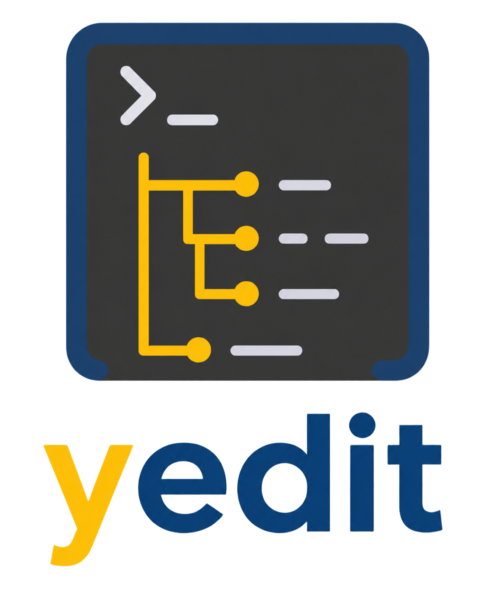
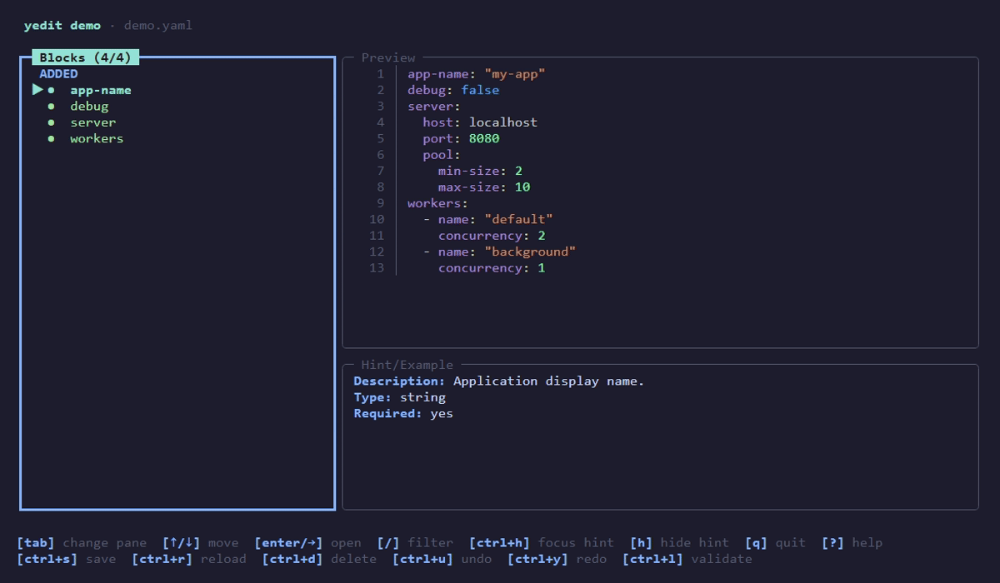

<!-- markdownlint-disable MD033 -->
<p align="center">
  
</p>

<p align="center">
  <strong>A Go library that gives your CLI a schema-aware terminal editor for its YAML config.</strong><br>
  Your structs describe the file; yedit turns them into an editor that knows every field.
</p>

<p align="center">
  
  
  
</p>
<!-- markdownlint-enable MD033 -->

A CLI that reads a YAML file usually leaves its users alone with a text editor and the docs. They guess key names, indent by hand, and find out at run time that `concurency` was a typo. yedit is a library that closes that gap: call `editor.Run` from your own command with the struct your program already unmarshals into, and your users get an editor that lists what can go in the file, explains each field, fills in presets, and refuses to save what your program would reject.

yedit is only a library: there is no yedit binary to install and nothing for your users to run on its own. It is what you use to build a schema-aware editor into your own program, for your program's own config; [`cmd/demo`](cmd/demo/main.go) is just an example of that.

## Quick Demo

Given the structs a program already unmarshals its config into, plus a `Metadata()` method that documents each field:

```go
type PoolConfig struct {
	MinSize int `yaml:"min-size"`
	MaxSize int `yaml:"max-size"`
}

type ServerConfig struct {
	Host string     `yaml:"host"`
	Port int        `yaml:"port"`
	Pool PoolConfig `yaml:"pool"`
}

type Worker struct {
	Name        string `yaml:"name"`
	Concurrency int    `yaml:"concurrency"`
}

type Config struct {
	AppName string       `yaml:"app-name"`
	Debug   bool         `yaml:"debug"`
	Server  ServerConfig `yaml:"server"`
	Workers []Worker     `yaml:"workers"`
}

// Each struct documents its own fields; ServerConfig, PoolConfig and Worker
// declare theirs the same way, and metadata.New composes them.
func (Config) Metadata() map[string]any {
	return map[string]any{
		"app-name": map[string]any{"description": "Application display name.", "required": true},
		"debug":    map[string]any{"description": "Enable debug logging.", "default": "false"},
		"server":   map[string]any{"description": "HTTP server configuration."},
		"workers":  map[string]any{"description": "Background worker pools."},
	}
}
```

one call opens an editor for `demo.yaml`, with two presets for the `server` block and the required fields enforced:

```go
meta, err := metadata.New(Config{})
if err != nil {
	log.Fatal(err)
}
_, err = editor.Run(editor.Config{
	Path:        "demo.yaml",
	Schema:      &Config{},
	Metadata:    meta,
	EnableHints: true,
	BlockPresets: presets.ForField("server", map[string]ServerConfig{
		"minimal":    {Host: "localhost", Port: 8080, Pool: PoolConfig{MinSize: 2, MaxSize: 5}},
		"production": {Host: "0.0.0.0", Port: 443, Pool: PoolConfig{MinSize: 10, MaxSize: 100}},
	}),
	Validators: []editor.Validator{editor.RequiredFromMetadata()},
})
```

and this is what the user gets: the blocks of the file with the hint for each, the `server` block as a field tree, the `production` preset applied from its preview, the `workers` list in its `[N]` navigator, undo and redo of a whole block, validation, and a confirmed save.



The full program is [`cmd/demo`](cmd/demo/main.go). Run it from the repo root; it seeds `demo.yaml` on first run:

```sh
go run ./cmd/demo [-theme grape]
```

---

## Highlights

| | |
| --- | --- |
| 🧬 **Your struct is the schema** | yedit reads your Go types by their `yaml` tags. Nested structs, lists, maps, unions and self-referential types all work, and the editor follows the struct as it changes. |
| 📚 **Help beside every field** | A `Metadata()` method on each struct describes its own fields: description, type, default, allowed values, ranges, examples. The side panel shows them for the field under the cursor. |
| 🌲 **Tree, YAML and preview together** | Each block opens as a field tree next to its YAML. Check a field to add it, drill into a list or map through the `[N]` navigator, and watch the document update as you go. |
| ✅ **Validation before save** | Required fields, formats, ranges, mutually exclusive keys and your own rules run on `ctrl+l` and before every save. Unknown keys are flagged, so a typo cannot slip through. |
| 🧩 **Presets** | Offer ready-made snippets per field or for the whole document, previewed before they are applied. |
| ↩️ **Two-level undo** | Undo inside the block you are editing, and undo whole block commits from the list. |
| 🎨 **Themes** | 58 built-in themes plus an adaptive default that follows the terminal's light or dark background, all from [bezel](https://github.com/lucasassuncao/bezel). |
| 🔎 **Session tracing** | `Config.Trace.Dump` records every key, message and action to a JSONL file, so a bug report can be read back step by step. |
| 🚪 **Headless too** | The validation rules and the violation report run without the TUI, for a `validate` command or CI. |

## Used by

| App | What it edits |
| --- | --- |
| [movelooper](https://github.com/lucasassuncao/movelooper) | `movelooper edit` for its file-organizing rules, and `movelooper validate` through the headless report |
| [apptide](https://github.com/lucasassuncao/apptide) | `apptide edit` for its package manager configuration |
| [devcontainerwizard](https://github.com/lucasassuncao/devcontainerwizard) | `edit` for the `config.yaml` it turns into a `devcontainer.json`, and `show-examples` through the preset viewer |

## Install

```sh
go get github.com/lucasassuncao/yedit
```

## Getting started

The Quick Demo above is the whole pattern: a struct per level of the file, a `Metadata()` method on each, and `editor.Run`. A key in `Metadata()` that matches no field is a startup error, so the docs cannot drift from the struct. When the root struct comes from a package you do not own, build the same tree by hand with `metadata.NewFromTree`.

[Getting Started](docs/GETTING-STARTED.md) walks through validators, presets and the rest.

## Documentation

| Document | Contents |
| --- | --- |
| [Getting Started](docs/GETTING-STARTED.md) | Struct, metadata, `editor.Run`, validators and presets, end to end |
| [Config Reference](docs/CONFIG-REFERENCE.md) | Every `editor.Config` field in one table |
| [Schema Kinds](docs/SCHEMA-KINDS.md) | How Go types map to editor behavior (object, list, dictionary, variant, …) |
| [Validators](docs/VALIDATORS.md) | Every built-in rule, with examples |
| [Presets](docs/PRESETS.md) | Snippets for the block and document preset pickers |
| [Metadata and Hints](docs/METADATA-AND-HINTS.md) | What the hint panel shows and where it comes from |
| [Interaction Model](docs/INTERACTION.md) | Key bindings and the tree action matrix |
| [Undo & Redo](docs/UNDO.md) | The two undo levels and what each tracks |
| [Themes](docs/THEMES.md) | Built-in themes and custom colors |
| [Doc Generation](docs/DOC-GENERATION.md) | Reference docs and JSON Schema from the same `Metadata()`, via [docgen](https://github.com/lucasassuncao/docgen) |
| [Session Tracing](docs/SESSION-TRACING.md) | `Config.Trace.Dump` and the `OnAction`/`OnModelAction`/`OnMsg` hooks |
| [Known Limitations](docs/LIMITATIONS.md) | Dependency behaviors that can surprise you |

## How it is built

yedit keeps the YAML: the schema, the document and its mutations, validation and the editor's state machine. Everything it draws with comes from [bezel](https://github.com/lucasassuncao/bezel), the TUI library it shares with its sibling apps: the shell that owns layout, legend and status, the list and tree widgets, the dialogs and the themes. Each package is usable on its own: `schema`, `metadata`, `validate` and `document` import no terminal library at all, and `report` only uses one to color its output.

For contributors: [Architecture](docs/dev/ARCHITECTURE.md) and the [Development Guide](docs/dev/DEVELOPMENT.md), which also covers recording the demos.

## License

Released under the [MIT License](LICENSE).
