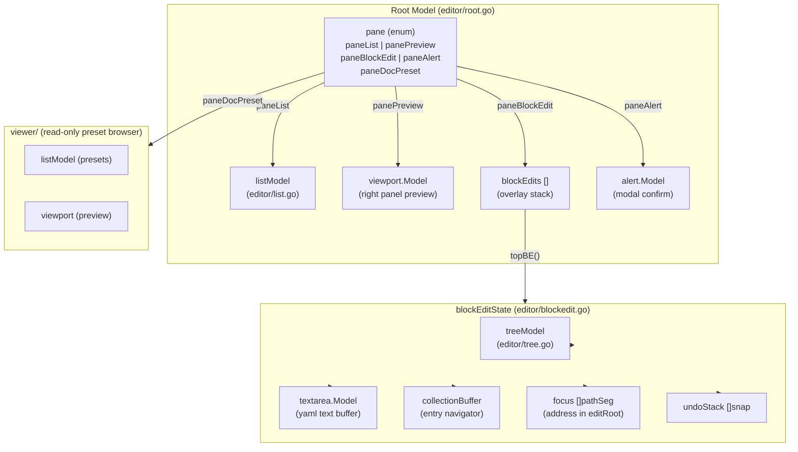
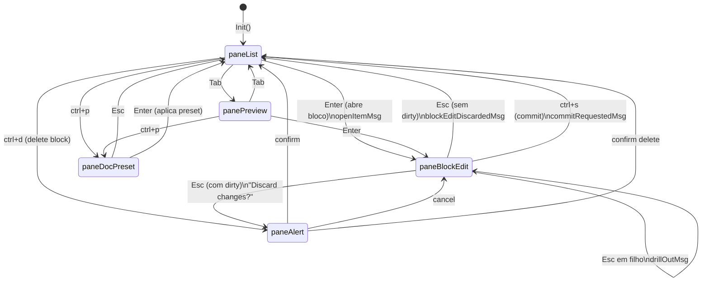
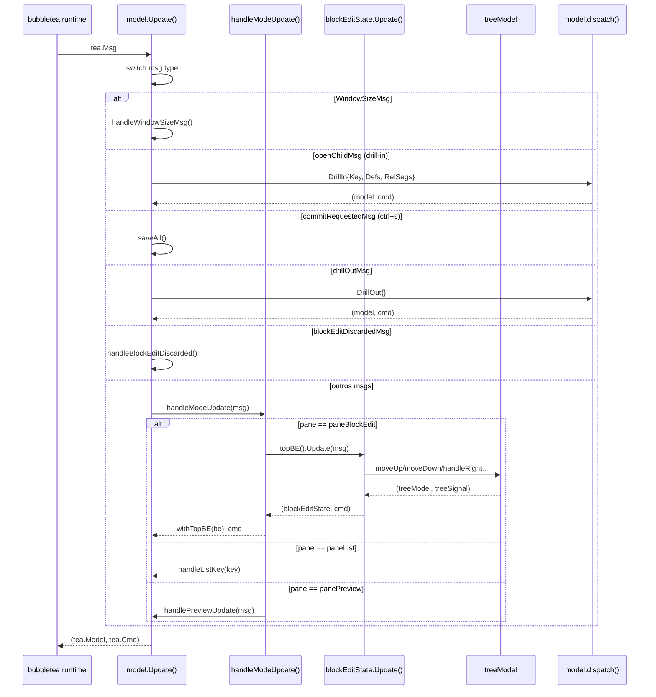
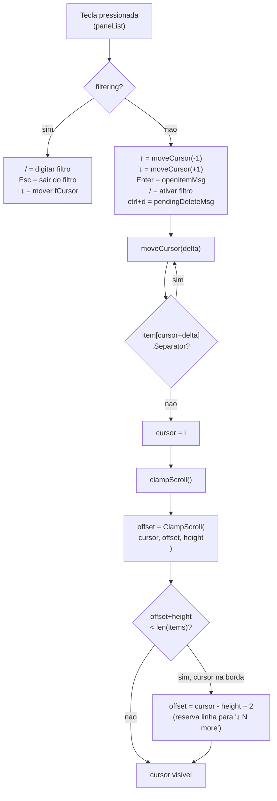
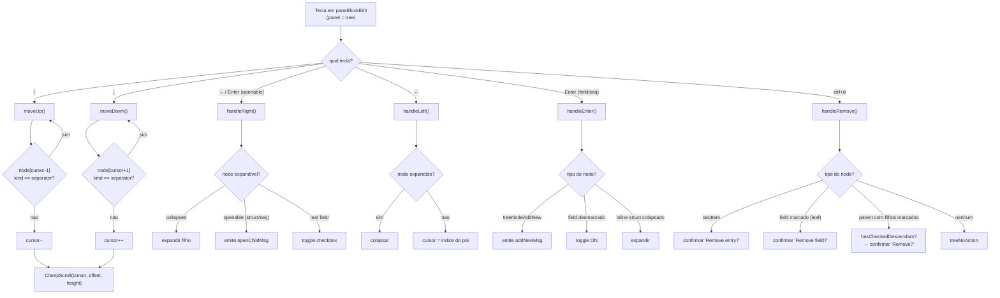
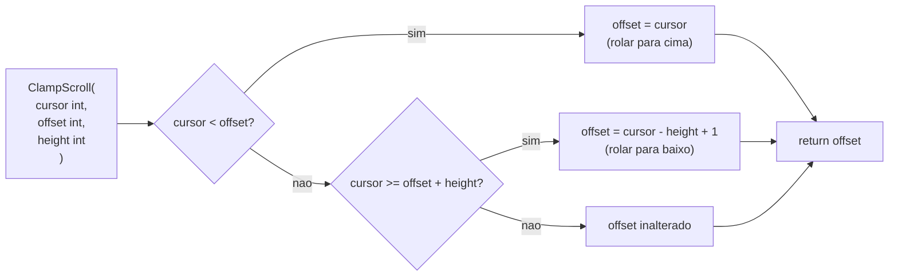
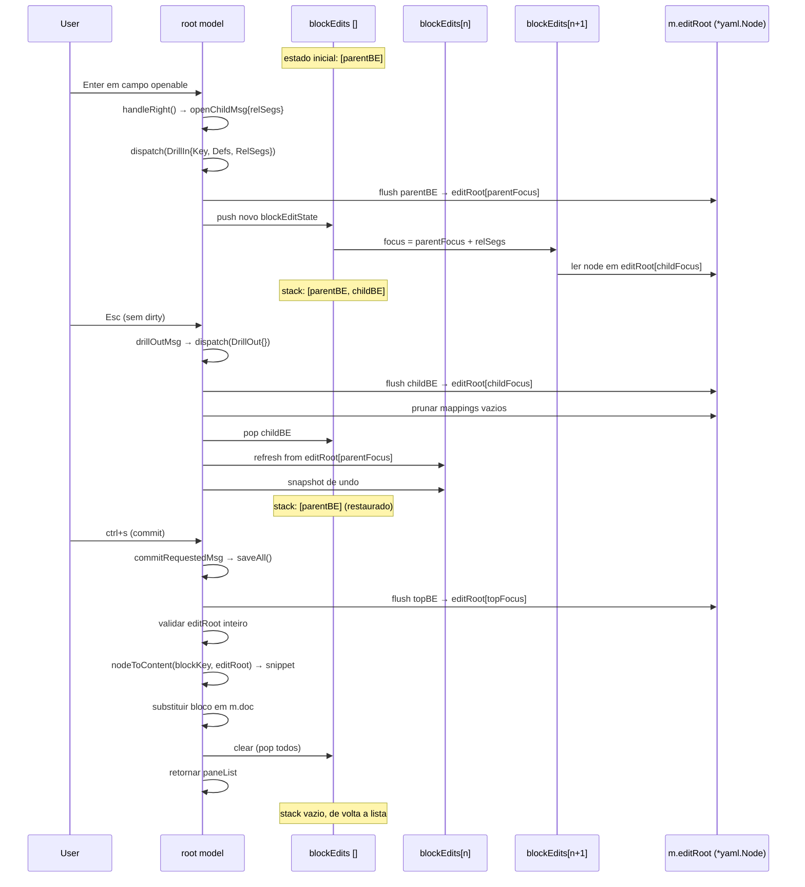
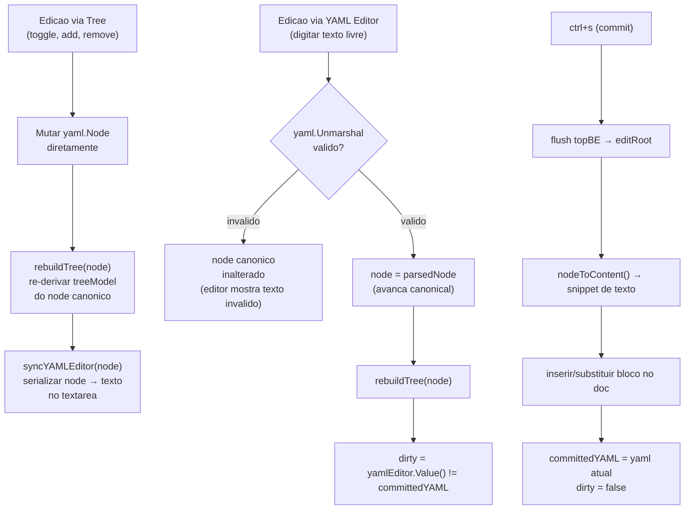

# yedit - Fluxo da TUI

## 1. Hierarquia de Componentes

**Passo a passo:**

1. O `model` raiz (definido em `editor/root.go`) e o unico `tea.Model` entregue ao bubbletea. Ele contem tudo.
2. O campo `pane` (um enum int) determina qual componente esta ativo no momento e recebe input de teclado.
3. Quando `pane == paneList`, o `listModel` renderiza o painel esquerdo com os blocos do documento.
4. Quando `pane == panePreview`, o `viewport.Model` renderiza o YAML do bloco selecionado em modo leitura.
5. Quando `pane == paneBlockEdit`, o campo `blockEdits []blockEditState` (uma stack) esta ativo. O elemento do topo (`topBE()`) e o editor visivel.
6. Cada `blockEditState` contem: `treeModel` (arvore de campos), `textarea.Model` (buffer de texto YAML), `collectionBuffer` (navegador de entradas de colecoes), `focus []pathSeg` (endereco do no dentro de `editRoot`) e `undoStack`.
7. Quando `pane == paneAlert`, o `alert.Model` renderiza um dialogo modal de confirmacao sobre toda a tela.
8. Quando `pane == paneDocPreset`, o pacote `viewer/` assume a tela com um browser de presets em modo leitura.

---

## 2. Maquina de Estados - Transicoes de Pane

**Passo a passo:**

1. A aplicacao inicia sempre em `paneList`, mostrando os blocos do documento YAML.
2. Pressionar `Tab` alterna entre `paneList` e `panePreview` sem perder estado.
3. Pressionar `Enter` em qualquer bloco emite `openItemMsg` e transiciona para `paneBlockEdit`, empurrando um novo `blockEditState` na stack.
4. Dentro do editor (`paneBlockEdit`), pressionar `Enter` ou `→` em um campo do tipo struct ou sequencia emite `openChildMsg` e faz drill-in: um novo `blockEditState` filho e empurrado, mas o pane permanece `paneBlockEdit`.
5. Pressionar `Esc` dentro de um editor filho emite `drillOutMsg`: o filho e desempilhado e o pai e restaurado — o pane continua `paneBlockEdit`.
6. Pressionar `Esc` no editor raiz (sem mudancas pendentes) emite `blockEditDiscardedMsg` e retorna a `paneList`.
7. Pressionar `Esc` no editor raiz com mudancas pendentes (`dirty == true`) transiciona para `paneAlert` com a pergunta "Discard changes?".
8. No `paneAlert`: confirmar retorna a `paneList` descartando as mudancas; cancelar retorna a `paneBlockEdit` preservando o estado do editor.
9. Pressionar `ctrl+s` em qualquer nivel do editor emite `commitRequestedMsg`, valida e serializa o bloco, e retorna a `paneList`.
10. Pressionar `ctrl+p` em `paneList` ou `panePreview` abre o browser de presets de documento (`paneDocPreset`); `Esc` ou `Enter` retornam a `paneList`.
11. `ctrl+d` na lista dispara uma confirmacao de delecao via `paneAlert`; confirmar volta a `paneList` com o bloco removido.

---

## 3. Fluxo de Mensagens (Update)

**Passo a passo:**

1. O bubbletea runtime chama `model.Update(msg)` a cada evento (tecla, resize, resultado de I/O assincrono).
2. `Update` primeiro faz um switch no tipo concreto da mensagem para capturar eventos de alto nivel que requerem acesso ao model raiz: `WindowSizeMsg`, `openChildMsg`, `commitRequestedMsg`, `drillOutMsg`, `blockEditDiscardedMsg`.
3. Mensagens de resize (`WindowSizeMsg`) atualizam as dimensoes do model raiz e propagam para todos os editores empilhados.
4. `openChildMsg` e `drillOutMsg` sao redirecionados para `model.dispatch()`, que manipula a stack de editores e retorna o novo model.
5. Todas as outras mensagens (teclas, scroll, etc.) caem no `handleModeUpdate`, que delega para o componente ativo segundo o valor de `pane`.
6. Quando `pane == paneBlockEdit`, a mensagem e entregue ao `blockEditState.Update()` do editor do topo da stack.
7. Dentro do `blockEditState.Update()`, teclas de navegacao sao encaminhadas para `treeModel`, que retorna um novo `treeModel` e um sinal (`treeAction`) indicando o que aconteceu (cursor moveu, campo foi toggled, etc.).
8. O `blockEditState` atualizado e devolvido ao model raiz via `withTopBE(be)`, que aloca uma nova slice com o editor substituido — garantindo que nenhum outro elemento da stack compartilhe o estado.
9. Todo o caminho e imutavel (copy-on-write): cada etapa retorna um novo valor, nunca muta in-place.

---

## 4. Navegacao na Lista Raiz (listModel)

**Passo a passo:**

1. A lista raiz opera em dois modos: normal e filtro. O campo `filtering bool` controla qual handler recebe o input.
2. No modo normal, `↑`/`↓` chamam `moveCursor(-1)` e `moveCursor(+1)`.
3. `moveCursor(delta)` itera a partir da posicao atual na direcao do delta, pulando automaticamente qualquer item com `Separator == true` (cabecalhos de secao como ADDED, AVAILABLE, UNKNOWN). O cursor nunca para em um separador.
4. Ao encontrar o primeiro item nao-separador, o cursor e atualizado e `clampScroll()` e chamado.
5. `clampScroll()` primeiro chama `ClampScroll(cursor, offset, height)` para garantir que o cursor esta dentro da janela visivel.
6. Em seguida verifica se ha itens abaixo da janela (`offset+height < len(items)`): se sim e o cursor esta na ultima linha visivel, o offset e ajustado em +1 extra para reservar a ultima linha para o indicador "↓ N more".
7. Pressionar `/` ativa o modo filtro: o cursor passa a ser `fCursor` (separado do cursor normal), e cada caractere digitado filtra os itens em tempo real via `filteredItems()`.
8. No modo filtro, separadores tambem sao ignorados. `Esc` desativa o filtro e restaura o cursor original.
9. `Enter` na lista emite `openItemMsg` com o item sob o cursor (ou `fCursor` se em modo filtro), transitando para o editor.

---

## 5. Navegacao na Arvore (treeModel)

**Passo a passo:**

1. A arvore mantem uma lista flat (`nodes []treeNode`) derivada por DFS do `yaml.Node` canonico. Nos colapsados omitem seus filhos da lista via `visibleNodes()`.
2. `moveUp()` e `moveDown()` decrementam/incrementam o cursor e pulam nos do tipo `treeNodeSeparator` (cabecalhos de secao), exatamente como a lista raiz.
3. Apos cada movimento, `ClampScroll` ajusta `offset` para manter o cursor dentro da janela visivel.
4. `handleRight()` (tecla `→`) tem comportamento contextual: se o no esta colapsado, expande seus filhos; se e um campo do tipo struct ou sequencia (`openable`), emite `openChildMsg` para fazer drill-in; se e um campo folha, faz toggle do checkbox.
5. `handleLeft()` (tecla `←`) colapsa o no se ele estiver expandido; caso contrario, pula o cursor direto para o no pai (identificado por profundidade menor na lista flat).
6. `handleEnter()` tem tres comportamentos: na linha virtual "+ add new" (`treeNodeAddNew`) emite um sinal para adicionar entrada; em um campo desmarcado faz toggle ON; em um struct inline colapsado expande.
7. `handleRemove()` (`ctrl+d`) analisa o tipo do no atual: em um `seqItem` pede confirmacao de remocao de entrada; em um campo folha marcado pede confirmacao de remocao do campo; em um no pai sem checkbox propria, verifica `hasCheckedDescendant()` — se verdadeiro, pede confirmacao para remover a subarvore inteira; caso nenhum dos anteriores, retorna `treeNoAction` (noop silencioso).
8. Todos os metodos retornam `(treeModel, treeAction)`: o novo estado da arvore e um sinal que o `blockEditState` usa para decidir o que fazer em seguida (sync de YAML, emitir mensagem, etc.).

---

## 6. Clamp de Scroll - ClampScroll()

**Passo a passo:**

1. `ClampScroll` e uma funcao pura em `theme/` compartilhada por todos os componentes scrollaveis: `listModel`, `treeModel` e o browser de presets.
2. Recebe tres inteiros: `cursor` (posicao logica do item selecionado), `offset` (primeiro item visivel na janela) e `height` (numero de linhas visiveis).
3. Se `cursor < offset`, o cursor saiu pela parte de cima da janela: o offset e recuado ate o cursor (`offset = cursor`).
4. Se `cursor >= offset + height`, o cursor saiu pela parte de baixo da janela: o offset e avancado para que o cursor seja a ultima linha visivel (`offset = cursor - height + 1`).
5. Se o cursor esta dentro da janela atual, o offset nao muda.
6. O valor retornado e sempre o novo `offset` — o chamador e responsavel por aplicar o resultado de volta ao seu proprio campo `offset`.
7. Componentes que precisam de comportamento adicional (como a lista raiz reservando uma linha para "↓ N more") aplicam um ajuste extra apos chamar `ClampScroll`.

---

## 7. Overlay Stack - Drill-In / Drill-Out

**Passo a passo:**

1. `m.editRoot` e o unico `*yaml.Node` canonico para o bloco em edicao. Todos os editores empilhados leem e escrevem nele; nao ha copia por editor.
2. Ao fazer drill-in (`Enter` em campo openable): o estado atual do editor pai e serializado de volta para `editRoot` no endereco `parentFocus`; um novo `blockEditState` filho e criado com `focus = parentFocus + relSegs`; o filho le seu conteudo de `editRoot[childFocus]`; o filho e empurrado na stack.
3. A stack pode ter ate 10 niveis de profundidade (limite enforced em `dispatch`).
4. Ao fazer drill-out (`Esc` sem dirty): o estado do filho e serializado para `editRoot[childFocus]`; mappings vazios gerados pela operacao sao podados; o filho e removido da stack; o pai e refrescado lendo `editRoot[parentFocus]` e recebe um snapshot de undo para que o drill-out seja desfeito com `ctrl+z`.
5. Drill-out preserva todas as edicoes feitas no filho — elas ja estao em `editRoot` e o pai as ve ao recarregar.
6. Ao fazer commit (`ctrl+s`): o editor do topo e serializado para `editRoot`; `editRoot` inteiro e validado (campos obrigatorios, formatos, dependencias entre campos); o no e serializado para texto via `nodeToContent`; o snippet substitui o bloco correspondente em `m.doc`; toda a stack e esvaziada e o pane retorna a `paneList`.
7. Se a validacao falhar, o commit nao ocorre e o erro e exibido na status bar — o usuario permanece no editor.

---

## 8. Sincronizacao Tree ↔ YAML

**Passo a passo:**

1. Ha uma unica fonte da verdade: o `yaml.Node` canonico (`be.node`). A arvore e o editor de texto sao sempre derivados dele — nunca o inverso.
2. Quando o usuario edita via arvore (toggle, add, remove): o `yaml.Node` e mutado diretamente; a arvore e re-derivada do no via `rebuildTree`; o textarea e atualizado com a serializacao do no via `syncYAMLEditor`. O texto no editor sempre reflete o no canonico.
3. Quando o usuario digita no textarea: o conteudo e submetido a um parse-gate — `yaml.Unmarshal` tenta interpretar o texto. Se o YAML for invalido, o `be.node` canonico nao e alterado; o textarea continua mostrando o texto invalido mas a arvore permanece consistente com o ultimo estado valido.
4. Se o YAML for valido, `be.node` e avancado para o no parseado e a arvore e re-derivada.
5. Apos qualquer edicao via textarea, o campo `dirty` e recalculado comparando `yamlEditor.Value()` com `committedYAML` (o YAML no momento do ultimo commit ou da abertura do editor). Se forem iguais, `dirty` volta a `false` — permitindo que o usuario "desfaca manualmente" sem acionar o dialogo de confirmacao.
6. No commit (`ctrl+s`): o editor do topo e serializado para `editRoot`; `nodeToContent` produz o snippet de texto final; o bloco correspondente em `m.doc` e substituido; `committedYAML` e atualizado para o YAML atual e `dirty` e zerado.

---

## 9. Maquina de Acoes - dispatch()

```mermaid
flowchart TD
    BA["BlockAction\n(dispatch no blockEditState)"] --> BA_SW{"tipo?"}
    BA_SW --> TF["ToggleField{NodeIdx}\n→ toggle no yaml.Node\n→ rebuildTree"]
    BA_SW --> SY["SyncYAML{Content}\n→ parse-gated update\n→ dirty check"]
    BA_SW --> AE["AddEntry{}\n→ append seq item\n→ rebuildTree"]
    BA_SW --> DE["DeleteEntry{SeqIdx}\n→ remove seq[i]\n→ rebuildTree"]
    BA_SW --> NE["NavigateEntry{Idx}\n→ flush current entry\n→ load entry[Idx]"]
    BA_SW --> AP["ApplyPreset / AppendPreset\n→ substituir/mesclar node\n→ rebuildTree"]
    BA_SW --> UR["Undo / Redo\n→ restaurar snapshot"]

    MA["ModelAction\n(dispatch no root model)"] --> MA_SW{"tipo?"}
    MA_SW --> OB["OpenBlock{Key}\n→ push blockEditState\n→ paneBlockEdit"]
    MA_SW --> CB["CommitBlock{}\n→ validar + serializar\n→ substituir em m.doc\n→ pop stack"]
    MA_SW --> DB["DeleteBlock{Key}\n→ remover de m.doc\n→ rebuild list"]
    MA_SW --> SV["Save{}\n→ gravar m.doc em disco\nasync (saveResultMsg)"]
    MA_SW --> RL["Reload{}\n→ re-ler disco\nasync (reloadResultMsg)"]
    MA_SW --> DI["DrillIn{Key, Defs, RelSegs}\n→ push child blockEditState\n→ focus = parentFocus + relSegs"]
    MA_SW --> DO["DrillOut{}\n→ flush child → editRoot\n→ pop child\n→ refresh parent"]
```

**Passo a passo:**

1. Ha dois dispatch separados: `blockEditState.dispatch(BlockAction)` para mutacoes sincronas do editor, e `model.dispatch(ModelAction)` para operacoes no nivel do documento.
2. Ambas as interfaces (`BlockAction`, `ModelAction`) usam metodos unexported (`blockAction()`, `modelAction()`) para impedir que tipos fora do pacote `editor` as implementem — funcionando como uma union discriminada type-safe.
3. `ToggleField{NodeIdx, Checked}`: salva snapshot de undo, marca `dirty`, chama `applyToggle` que muta o `yaml.Node` canonico, depois re-sincroniza a arvore via `resyncTreeFromYAML`. Se o YAML resultante for igual ao `committedYAML`, `dirty` e zerado.
4. `SyncYAML{Content, Checkpoint}`: quando `Checkpoint == true` (ex: colar texto), salva undo antes; aplica parse-gate; se valido avanca `be.node` e re-deriva arvore.
5. `AddEntry` e `DeleteEntry` operam na lista de entradas de uma colecao: flush da entrada atual, mutacao do slice de `yaml.Node`, rebuild da arvore de colecao.
6. `NavigateEntry{Idx}`: serializa a entrada atual de volta para `be.node`, carrega o YAML da entrada `Idx` no textarea e ajusta `coll.current`.
7. `ApplyPreset` substitui o `be.node` inteiro pelo no do preset; `AppendPreset` mescla as entradas do preset nas existentes.
8. `Undo` e `Redo` restauram snapshots da `undoStack`/`redoStack` — cada snapshot contem o `yaml.Node`, o texto do editor e o estado da arvore.
9. No nivel do model: `OpenBlock` cria um novo `blockEditState` e empurra na stack; `CommitBlock` valida, serializa e desempilha tudo; `DrillIn`/`DrillOut` manipulam a stack como descrito no diagrama 7; `Save` e `Reload` disparam I/O assincrono e retornam `tea.Cmd` — o resultado chega depois via `saveResultMsg`/`reloadResultMsg`.
