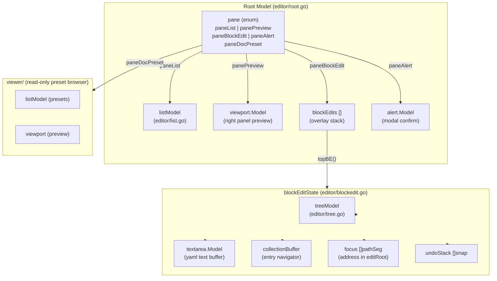
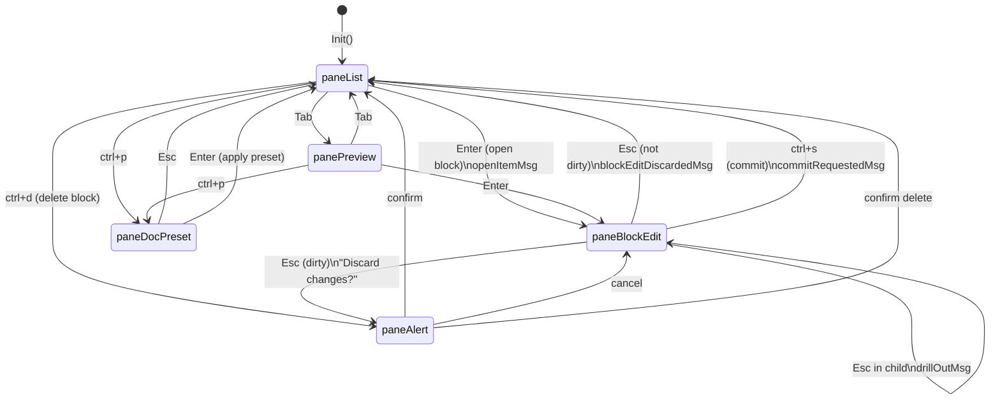
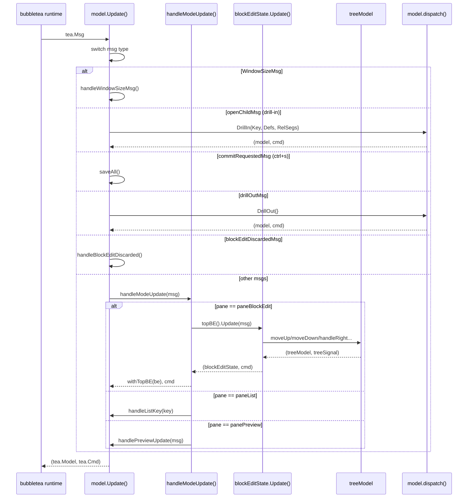
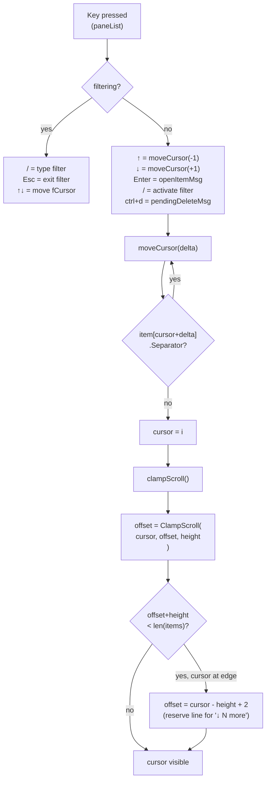
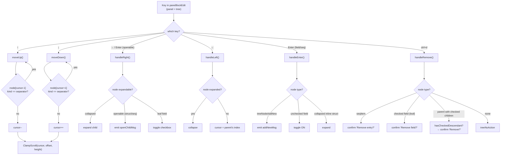
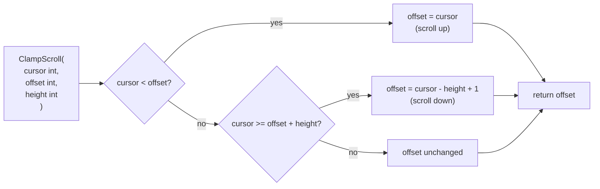
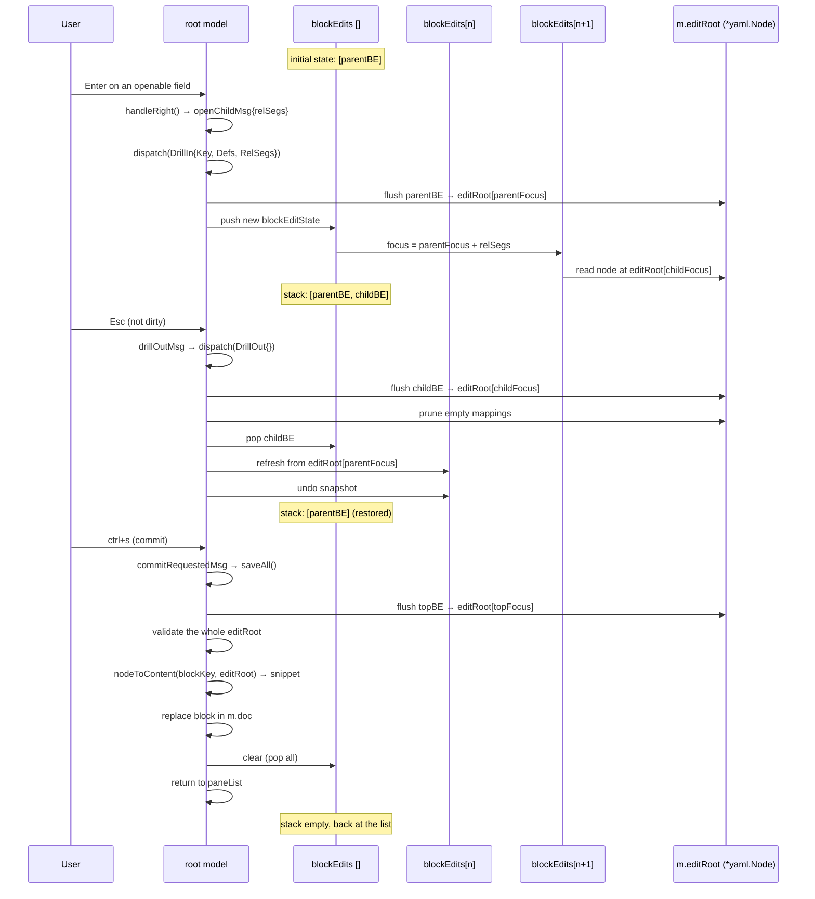
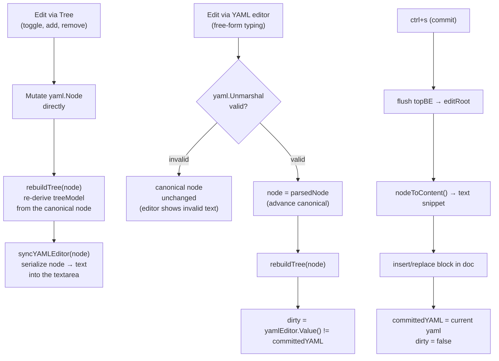

# TUI dispatch flow

Fine-grained mechanics of the block editor and root model: component hierarchy, pane state machine, message routing, and the dispatch layer. For package-level structure and import graph, see [Architecture](ARCHITECTURE.md).

## 1. Component hierarchy

1. The root `model` (defined in `editor/root.go`) is the single `tea.Model` handed to bubbletea. It contains everything.
2. The `pane` field (an int enum) determines which component is active and receives keyboard input.
3. When `pane == paneList`, `listModel` renders the left panel with the document's blocks.
4. When `pane == panePreview`, `viewport.Model` renders the selected block's YAML in read-only mode.
5. When `pane == paneBlockEdit`, the `blockEdits []blockEditState` field (a stack) is active. The top element (`topBE()`) is the visible editor.
6. Each `blockEditState` holds: `treeModel` (field tree), `textarea.Model` (YAML text buffer), `collectionBuffer` (collection entry navigator), `focus []pathSeg` (this node's address inside `editRoot`), and `undoStack`.
7. When `pane == paneAlert`, `alert.Model` renders a full-screen modal confirmation dialog.
8. When `pane == paneDocPreset`, the `viewer/` package takes over the screen with a read-only preset browser.

---

## 2. State machine - pane transitions

1. The app always starts in `paneList`, showing the YAML document's blocks.
2. Pressing `Tab` toggles between `paneList` and `panePreview` without losing state.
3. Pressing `Enter` on any block emits `openItemMsg` and transitions to `paneBlockEdit`, pushing a new `blockEditState` onto the stack.
4. Inside the editor (`paneBlockEdit`), pressing `Enter` or `→` on a struct- or sequence-typed field emits `openChildMsg` and drills in: a new child `blockEditState` is pushed, but the pane stays `paneBlockEdit`.
5. Pressing `Esc` inside a child editor emits `drillOutMsg`: the child is popped and the parent is restored - the pane stays `paneBlockEdit`.
6. Pressing `Esc` in the root editor (no pending changes) emits `blockEditDiscardedMsg` and returns to `paneList`.
7. Pressing `Esc` in the root editor with pending changes (`dirty == true`) transitions to `paneAlert` with the "Discard changes?" prompt.
8. In `paneAlert`: confirming returns to `paneList`, discarding the changes; canceling returns to `paneBlockEdit`, preserving the editor's state.
9. Pressing `ctrl+s` at any level of the editor emits `commitRequestedMsg`, which validates and serializes the block, then returns to `paneList`.
10. Pressing `ctrl+p` in `paneList` or `panePreview` opens the document preset browser (`paneDocPreset`); `Esc` or `Enter` return to `paneList`.
11. `ctrl+d` on the list triggers a delete confirmation via `paneAlert`; confirming returns to `paneList` with the block removed.

---

## 3. Message flow (Update)

1. The bubbletea runtime calls `model.Update(msg)` for every event (keypress, resize, async I/O result).
2. `Update` first switches on the message's concrete type to catch high-level events that need access to the root model: `WindowSizeMsg`, `openChildMsg`, `commitRequestedMsg`, `drillOutMsg`, `blockEditDiscardedMsg`. Several other messages are also handled directly here rather than through `model.dispatch(ModelAction)` - see [Session Tracing](../SESSION-TRACING.md#coverage-every-action-is-captured) for the full list and why it matters for reproducing a session.
3. Resize messages (`WindowSizeMsg`) update the root model's dimensions and propagate to every stacked editor.
4. `openChildMsg` and `drillOutMsg` are redirected to `model.dispatch()`, which manipulates the editor stack and returns the new model.
5. Every other message (keys, scroll, etc.) falls through to `handleModeUpdate`, which delegates to the active component based on `pane`.
6. When `pane == paneBlockEdit`, the message is delivered to the top-of-stack editor's `blockEditState.Update()`.
7. Inside `blockEditState.Update()`, navigation keys are forwarded to `treeModel`, which returns a new `treeModel` and a signal (`treeAction`) describing what happened (cursor moved, field toggled, etc.).
8. The updated `blockEditState` is handed back to the root model via `withTopBE(be)`, which allocates a new slice with the editor replaced - guaranteeing no other stack element shares state.
9. The whole path is immutable (copy-on-write): every step returns a new value, never mutates in place.

---

## 4. Root list navigation (listModel)

1. The root list operates in two modes: normal and filter. The `filtering bool` field controls which handler receives input.
2. In normal mode, `↑`/`↓` call `moveCursor(-1)` and `moveCursor(+1)`.
3. `moveCursor(delta)` iterates from the current position in the delta's direction, automatically skipping any item with `Separator == true` (section headers like ADDED, AVAILABLE, UNKNOWN). The cursor never lands on a separator.
4. Once a non-separator item is found, the cursor is updated and `clampScroll()` is called.
5. `clampScroll()` first calls `ClampScroll(cursor, offset, height)` to keep the cursor inside the visible window.
6. It then checks whether there are items below the window (`offset+height < len(items)`): if so, and the cursor is on the last visible line, the offset gets an extra +1 to reserve the last line for the "↓ N more" indicator.
7. Pressing `/` activates filter mode: the cursor becomes `fCursor` (separate from the normal cursor), and each typed character filters the items live via `filteredItems()`.
8. In filter mode, separators are also skipped. `Esc` deactivates the filter and restores the original cursor.
9. `Enter` on the list emits `openItemMsg` with the item under the cursor (or `fCursor` in filter mode), transitioning to the editor.

---

## 5. Tree navigation (treeModel)

1. The tree keeps a flat list (`nodes []treeNode`) derived by DFS from the canonical `yaml.Node`. Collapsed nodes omit their children from the list via `visibleNodes()`.
2. `moveUp()` and `moveDown()` decrement/increment the cursor and skip `treeNodeSeparator` nodes (section headers), exactly like the root list.
3. After every move, `ClampScroll` adjusts `offset` to keep the cursor inside the visible window.
4. `handleRight()` (the `→` key) is context-sensitive: if the node is collapsed, it expands its children; if it's a struct- or sequence-typed field (`openable`), it emits `openChildMsg` to drill in; if it's a leaf field, it toggles the checkbox.
5. `handleLeft()` (the `←` key) collapses the node if expanded; otherwise it jumps the cursor straight to the parent node (identified by a lower depth in the flat list).
6. `handleEnter()` has three behaviors: on the virtual "+ add new" row (`treeNodeAddNew`) it emits a signal to add an entry; on an unchecked field it toggles ON; on a collapsed inline struct it expands.
7. `handleRemove()` (`ctrl+d`) inspects the current node's type: on a `seqItem` it asks to confirm removing the entry; on a checked leaf field it asks to confirm removing the field; on a parent node with no checkbox of its own, it checks `hasCheckedDescendant()` - if true, it asks to confirm removing the whole subtree; otherwise it returns `treeNoAction` (a silent no-op).
8. All methods return `(treeModel, treeAction)`: the tree's new state and a signal the `blockEditState` uses to decide what to do next (sync YAML, emit a message, etc.).

---

## 6. Scroll clamping - ClampScroll()

1. `ClampScroll` is a pure function in `theme/` shared by every scrollable component: `listModel`, `treeModel`, and the preset browser.
2. It takes three integers: `cursor` (the selected item's logical position), `offset` (the first visible item in the window), and `height` (the number of visible lines).
3. If `cursor < offset`, the cursor scrolled past the top of the window: the offset is pulled back to the cursor (`offset = cursor`).
4. If `cursor >= offset + height`, the cursor scrolled past the bottom of the window: the offset is advanced so the cursor becomes the last visible line (`offset = cursor - height + 1`).
5. If the cursor is inside the current window, the offset does not change.
6. The returned value is always the new `offset` - the caller is responsible for writing the result back to its own `offset` field.
7. Components that need extra behavior (like the root list reserving a line for "↓ N more") apply an additional adjustment after calling `ClampScroll`.

---

## 7. Overlay stack - drill-in / drill-out

1. `m.editRoot` is the single canonical `*yaml.Node` for the block being edited. Every stacked editor reads and writes it directly; there is no per-editor copy.
2. On drill-in (`Enter` on an openable field): the parent editor's current state is serialized back into `editRoot` at `parentFocus`; a new child `blockEditState` is created with `focus = parentFocus + relSegs`; the child reads its content from `editRoot[childFocus]`; the child is pushed onto the stack.
3. The stack can hold up to 10 levels of depth (a limit enforced in `dispatch`).
4. On drill-out (`Esc` with no pending changes): the child's state is serialized into `editRoot[childFocus]`; empty mappings left behind by the operation are pruned; the child is removed from the stack; the parent is refreshed by reading `editRoot[parentFocus]` and gets an undo snapshot so the drill-out itself can be undone with `ctrl+z`.
5. Drill-out preserves every edit made in the child - it is already in `editRoot`, and the parent sees it on reload.
6. On commit (`ctrl+s`): the top editor is serialized into `editRoot`; the whole `editRoot` is validated (required fields, formats, cross-field dependencies); the node is serialized to text via `nodeToContent`; the resulting snippet replaces the corresponding block in `m.doc`; the entire stack is cleared and the pane returns to `paneList`.
7. If validation fails, the commit does not happen and the error is shown in the status bar - the user stays in the editor.

---

## 8. Tree ↔ YAML synchronization

1. There is a single source of truth: the canonical `yaml.Node` (`be.node`). The tree and the text editor are always derived from it - never the other way around.
2. When the user edits via the tree (toggle, add, remove): the `yaml.Node` is mutated directly; the tree is re-derived from the node via `rebuildTree`; the textarea is refreshed with the node's serialization via `syncYAMLEditor`. The text editor always reflects the canonical node.
3. When the user types into the textarea: the content goes through a parse-gate - `yaml.Unmarshal` attempts to interpret the text. If the YAML is invalid, the canonical `be.node` is left unchanged; the textarea keeps showing the invalid text, but the tree stays consistent with the last valid state.
4. If the YAML is valid, `be.node` advances to the parsed node and the tree is re-derived.
5. After any textarea edit, the `dirty` flag is recomputed by comparing `yamlEditor.Value()` against `committedYAML` (the YAML at the last commit or at editor open). If they match, `dirty` goes back to `false` - letting the user "manually undo" without triggering the confirm dialog.
6. On commit (`ctrl+s`): the top editor is serialized into `editRoot`; `nodeToContent` produces the final text snippet; the corresponding block in `m.doc` is replaced; `committedYAML` is updated to the current YAML and `dirty` is cleared.

---

## 9. Action dispatch

```mermaid
flowchart TD
    BA["BlockAction\n(dispatch on blockEditState)"] --> BA_SW{"type?"}
    BA_SW --> TF["ToggleField{NodeIdx}\n→ toggle in yaml.Node\n→ rebuildTree"]
    BA_SW --> SY["SyncYAML{Content}\n→ parse-gated update\n→ dirty check"]
    BA_SW --> AE["AddEntry{}\n→ append seq item\n→ rebuildTree"]
    BA_SW --> DE["DeleteEntry{SeqIdx}\n→ remove seq[i]\n→ rebuildTree"]
    BA_SW --> NE["NavigateEntry{Idx}\n→ flush current entry\n→ load entry[Idx]"]
    BA_SW --> AP["ApplyPreset / AppendPreset\n→ replace/merge node\n→ rebuildTree"]
    BA_SW --> UR["Undo / Redo\n→ restore snapshot"]

    MA["ModelAction\n(dispatch on root model)"] --> MA_SW{"type?"}
    MA_SW --> CB["CommitBlock{}\n→ validate + serialize\n→ replace in m.doc\n→ pop stack"]
    MA_SW --> DB["DeleteBlock{Key}\n→ remove from m.doc\n→ rebuild list"]
    MA_SW --> SV["Save{}\n→ write m.doc to disk\nasync (saveResultMsg)"]
    MA_SW --> RL["Reload{}\n→ re-read from disk\nasync (reloadResultMsg)"]
    MA_SW --> DI["DrillIn{Key, Defs, RelSegs}\n→ push child blockEditState\n→ focus = parentFocus + relSegs"]
    MA_SW --> DO["DrillOut{}\n→ flush child → editRoot\n→ pop child\n→ refresh parent"]
```

1. There are two separate dispatch functions: `blockEditState.dispatch(BlockAction)` for synchronous editor mutations, and `model.dispatch(ModelAction)` for document-level operations.
2. Both interfaces (`BlockAction`, `ModelAction`) use unexported methods (`blockAction()`, `modelAction()`) to prevent types outside the `editor` package from implementing them - a type-safe discriminated union.
3. `ToggleField{NodeIdx, Checked}`: saves an undo snapshot, marks `dirty`, calls `applyToggle` which mutates the canonical `yaml.Node`, then re-syncs the tree via `resyncTreeFromYAML`. If the resulting YAML matches `committedYAML`, `dirty` is cleared.
4. `SyncYAML{Content, Checkpoint}`: when `Checkpoint == true` (e.g. pasting text), saves undo first; runs the content through the parse-gate; if valid, advances `be.node` and re-derives the tree.
5. `AddEntry` and `DeleteEntry` operate on a collection's entry list: flush the current entry, mutate the `yaml.Node` slice, rebuild the collection's tree.
6. `NavigateEntry{Idx}`: serializes the current entry back into `be.node`, loads entry `Idx`'s YAML into the textarea, and updates `coll.current`.
7. `ApplyPreset` replaces the whole `be.node` with the preset's node; `AppendPreset` merges the preset's entries into the existing ones.
8. `Undo` and `Redo` restore snapshots from `undoStack`/`redoStack` - each snapshot carries the `yaml.Node`, the editor text, and the tree state.
9. At the model level: `CommitBlock` validates, serializes, and pops the whole stack; `DeleteBlock` removes a block from the document and rebuilds the list; `DrillIn`/`DrillOut` manipulate the stack as shown in diagram 7; `Save` and `Reload` trigger async I/O and return a `tea.Cmd` - the result arrives later via `saveResultMsg`/`reloadResultMsg`.

> **Note:** `ModelAction` also declares an `OpenBlock{Key}` type, but opening a block from the root list never actually dispatches it - `openItemMsg` is handled directly in `model.Update`'s switch instead (see [Message flow](#3-message-flow-update), point 2). `OpenBlock`'s `case` in `model.dispatch` is unreachable in the running program today.
