# Editing Flow

Arquitetura atual. Cada bloco aberto tem um `*yaml.Node` canônico (`be.node`)
que é a **única fonte de verdade** para os dados; o texto do YAML pane e a
árvore de checkmarks são projeções derivadas dele. Keystokes são *parse-gated*:
`be.node` só avança quando o buffer parece válido — o estado anterior é mantido
enquanto o texto está incompleto.

```mermaid
stateDiagram-v2
    direction TB

    [*] --> Lista : inicialização

    %% ── Lista ─────────────────────────────────────────────────────────────────
    state Lista {
        direction LR
        [*] --> Navegando
        Navegando --> Filtrando : /
        Filtrando --> Navegando : Esc
        Navegando --> Preview  : Tab
        Preview   --> Navegando : Tab / Esc
        Navegando --> Navegando : h (toggle painel Hint/Example)
    }

    Lista --> BlockEdit    : Enter (abrir bloco) → editRoot parseado, focus=nil
    Lista --> AlertConfirm : ctrl+s (salvar arquivo)
    Lista --> AlertConfirm : Esc (doc dirty → "Quit without saving?")
    Lista --> [*]          : Esc (doc clean)

    %% ── BlockEdit ─────────────────────────────────────────────────────────────
    state BlockEdit {
        direction TB

        state "Editor Stack (blockEdits[]) — só UI + focus; dado em editRoot" as Stack {
            direction TB

            state "Struct Editor" as SE {
                direction LR
                [*] --> Editando_S
                Editando_S --> Editando_S   : digitar (YAML pane, buffer tolerante)
                Editando_S --> Editando_S   : toggle campo (Tree pane)
                Editando_S --> ConfirmRemove : ctrl+d (campo com conteúdo)
                ConfirmRemove --> Editando_S : Yes/No
                Editando_S --> PresetBrowser : p
                PresetBrowser --> Editando_S : Esc / aplicar preset
            }

            state "Collection Navigator" as CN {
                direction LR
                [*] --> Navegando_C
                Navegando_C --> Navegando_C   : ↑↓ (flush + loadEntry)
                Navegando_C --> Editando_C    : Tab (YAML pane)
                Editando_C  --> Navegando_C   : Tab (Tree pane)
                Navegando_C --> ConfirmDel    : ctrl+d
                ConfirmDel  --> Navegando_C   : Yes/No
                Navegando_C --> PresetBrowser_C : p
                PresetBrowser_C --> Navegando_C : Esc / aplicar
            }

            state "Scalar / sem-árvore (primitivo, enum, mapa/lista livre)" as ScE {
                direction LR
                [*] --> Editando_Sc
                Editando_Sc --> Editando_Sc : digitar (YAML pane focado direto)
            }
        }

        Stack --> Stack : Enter em campo openable (→)\nflush topo→editRoot; push focus+relSegs
        Stack --> Stack : Esc em nível aninhado (drill-out)\nflush topo→editRoot; pop; refresh pai — mantém edições
    }

    BlockEdit --> Lista     : Esc no nível raiz (dirty → "Discard changes?")
    BlockEdit --> Lista     : ctrl+s → commitAll() → editRoot serializado → m.doc
    BlockEdit --> AlertInfo : erro de validação

    %% ── Alertas ───────────────────────────────────────────────────────────────
    state AlertConfirm {
        [*] --> Aguardando
        Aguardando --> Confirmado : Enter/Y / Yes
        Aguardando --> Cancelado  : Esc/N / No
    }

    state AlertInfo {
        [*] --> Exibindo
        Exibindo --> [*] : Enter / Esc
    }

    AlertConfirm --> [*]      : Cancelado → volta ao estado anterior
    AlertConfirm --> Salvando : Confirmado (save)
    AlertConfirm --> [*]      : Confirmado (delete/discard)

    Salvando --> AlertInfo : sucesso → "Saved to X"
    Salvando --> AlertInfo : erro → "Save failed"
    AlertInfo --> Lista    : Enter/Esc

    %% ── Notas ───────────────────────────────────────────────────────────────
    note right of BlockEdit
        editRoot = árvore *yaml.Node canônica do bloco.
        be.focus = endereço indexado do editor nela.
        Drill-in (Enter em →): flush topo → setNodeAt(editRoot, focus);
          childFocus = focus + relSegs; filho lido de nodeAt(editRoot).
        Drill-out (Esc aninhado): flush topo → editRoot; pop;
          refresh do pai — edições preservadas (não destrutivo).
        Ctrl+S → commitAll(): flush topo → editRoot;
          serializa editRoot 1x → m.doc; enterList().
        Esc no nível raiz: sai do editor (dirty → "Discard changes?").
    end note

    note right of CN
        be.node é a fonte de verdade (seq/map node).
        flushCurrentEntry() parseia o editor → be.node.
        loadEntry() lê be.node → editor.
        Sempre flush antes de loadEntry ao trocar item.
    end note
```



## Ícones da árvore (painel Fields)

| Ícone | Significado |
|---|---|
| `●` / `○` | campo folha presente / ausente |
| `▾` / `▸` | struct aninhado expandido / colapsado **inline** |
| `→` | campo **openable**: Enter/→ abre um editor aninhado (drill-in), não expande inline |
| `▶` / `▼` | item de coleção colapsado / expandido |

A distinção `→` vs `▸` é deliberada: `→` sinaliza que o campo (ex.: `any`/`all`,
ou um `map[string]Struct`) navega para outro nível em vez de abrir os campos ali.

Campos openable seguem o realce de folha: **ativos** quando têm conteúdo,
**muted** quando vazios (o `checked` do nó é computado por conteúdo não-vazio, não
por mera presença da chave). Por isso o `ctrl+d` neles só age quando há conteúdo
a remover (com confirmação); num openable vazio é no-op.

## Painel Hint/Example

À direita-baixo, mostra o metadata do campo em foco a partir do `FieldDef`:
**type** (o tipo escalar concreto — `string`/`int`/`bool`/`float`/`duration` —,
não o genérico "primitive"), **required**, **default**, **values** (oneof) e um
**Example**. No overlay de edição é sempre visível; na Lista é alternado por `h`
(começa escondido, com o Preview ocupando a coluna inteira).

Blocos **sem árvore** (primitivo, enum, lista/mapa livre) deixaram de mostrar
`(no fields)`: o painel esquerdo exibe o próprio campo como item único e o
Hint/Example acompanha — então dá pra ver o que um bloco *AVAILABLE* espera antes
mesmo de abri-lo.

## Fonte de verdade: `be.node`

| Conceito | Descrição |
|---|---|
| `be.node` | `*yaml.Node` do bloco aberto — **única** fonte de dados. Para structs: o mapping de valor do bloco. Para coleções: o nó seq/map que contém todas as entradas. |
| `be.coll.current` | Índice da entrada mostrada no editor (coleções). |
| `blockEdits[]` | Stack de `blockEditState` para drill-in em campos openable (`→`). |
| `nodeToContent(key,node)` | Serializa `be.node` → texto do YAML pane. |
| `valueNodeOfSnippet(s)` | Parseia texto do YAML pane → nó candidato (gate de parse). |

## Fluxo de commit (Ctrl+S no editor)

```
struct block:
    be.yamlEditor.Value() → m.doc.Replace(be.key, snippet)

collection block:
    flushCurrentEntry()          ← parseia editor → be.node (gate de parse; erro bloqueia)
    nodeToContent(be.key, be.node) → snippet
    m.doc.Replace(be.key, snippet)
```

Salvar no arquivo é uma ação separada: Ctrl+S na lista → confirma → `m.doc.Save()`.

## Projeção de coleção: `be.node` como SOT

O nó canônico (`be.node`) é a única lista de entradas. Não existe mais um slice
`entries[]` paralelo:

```
be.node              ← seq/map node — fonte de verdade de todas as entradas
be.coll.current      ← índice da entrada exibida
entryViewYAML(...)   ← projeta be.node[current] → texto do editor
flushCurrentEntry()  ← parseia editor → be.node[current] (gate: rejeita inválido)
loadEntry(idx)       ← be.coll.current = idx; editor = entryViewYAML(idx)
collectionDeriveTree() ← re-projeta labels/checks de TODAS as entradas de be.node
```

**Regra:** chamar `loadEntry` sempre depois de `flushCurrentEntry` ao trocar de item.

## Transições de tela (centralizadas)

Os quatro métodos `enterList` / `enterPreview` / `enterBlockEdit` / `enterAlert`
são os únicos que mudam `m.mode`, setando o modo junto com seus dados. Garantem
por construção: `alert != nil ⟺ paneAlert` e `len(blockEdits) > 0 ⟺ paneBlockEdit`.

## Buffer tolerante (parse gate)

Digitar no YAML pane pode deixar o buffer transitoriamente inválido — nada é
perdido nem bloqueado. A cada keystroke que muda o conteúdo, `syncParsedNode`
tenta parsear o buffer:

- **Parse OK** → `be.node` avança para o novo nó; árvore é re-derivada dele.
- **Parse falhou** → `be.node` permanece no último estado válido; árvore é mantida.

Teclas que não alteram o conteúdo (setas, seleção) não disparam o gate — não há
o que re-projetar. A escrita canônica visível ao usuário (e o surfacing de erro)
ocorre no **flush** (navegação entre entradas / commit).
