# Editing Flow

Arquitetura atual após o refactor de robustez (ver `docs/architecture-refactor.md`).
A edição não usa mais um stack de cópias de string reconciliadas por splice; usa
uma **árvore `*yaml.Node` canônica única** (`model.editRoot`) navegada por um
**focus path indexado** (`be.focus []pathSeg`).

```mermaid
stateDiagram-v2
    direction TB

    [*] --> Lista : inicialização

    %% ── Lista ─────────────────────────────────────────────────────────────────
    state Lista {
        direction LR
        [*] --> Navegando
        Navegando --> Filtrando : /
        Filtrando --> Navegando : Esc
        Navegando --> Preview  : Tab
        Preview   --> Navegando : Tab / Esc
        Navegando --> Navegando : h (toggle painel Hint/Example)
    }

    Lista --> BlockEdit    : Enter (abrir bloco) → editRoot parseado, focus=nil
    Lista --> AlertConfirm : ctrl+s (salvar arquivo)
    Lista --> AlertConfirm : Esc (doc dirty → "Quit without saving?")
    Lista --> [*]          : Esc (doc clean)

    %% ── BlockEdit ─────────────────────────────────────────────────────────────
    state BlockEdit {
        direction TB

        state "Editor Stack (blockEdits[]) — só UI + focus; dado em editRoot" as Stack {
            direction TB

            state "Struct Editor" as SE {
                direction LR
                [*] --> Editando_S
                Editando_S --> Editando_S   : digitar (YAML pane, buffer tolerante)
                Editando_S --> Editando_S   : toggle campo (Tree pane)
                Editando_S --> ConfirmRemove : ctrl+d (campo com conteúdo)
                ConfirmRemove --> Editando_S : Yes/No
                Editando_S --> PresetBrowser : p
                PresetBrowser --> Editando_S : Esc / aplicar preset
            }

            state "Collection Navigator" as CN {
                direction LR
                [*] --> Navegando_C
                Navegando_C --> Navegando_C   : ↑↓ (flush + loadEntry)
                Navegando_C --> Editando_C    : Tab (YAML pane)
                Editando_C  --> Navegando_C   : Tab (Tree pane)
                Navegando_C --> ConfirmDel    : ctrl+d
                ConfirmDel  --> Navegando_C   : Yes/No
                Navegando_C --> PresetBrowser_C : p
                PresetBrowser_C --> Navegando_C : Esc / aplicar
            }

            state "Scalar / sem-árvore (primitivo, enum, mapa/lista livre)" as ScE {
                direction LR
                [*] --> Editando_Sc
                Editando_Sc --> Editando_Sc : digitar (YAML pane focado direto)
            }
        }

        Stack --> Stack : Enter em campo openable (→)\nflush topo→editRoot; push focus+relSegs
        Stack --> Stack : Esc em nível aninhado (drill-out)\nflush topo→editRoot; pop; refresh pai — mantém edições
    }

    BlockEdit --> Lista     : Esc no nível raiz (dirty → "Discard changes?")
    BlockEdit --> Lista     : ctrl+s → commitAll() → editRoot serializado → m.doc
    BlockEdit --> AlertInfo : erro de validação

    %% ── Alertas ───────────────────────────────────────────────────────────────
    state AlertConfirm {
        [*] --> Aguardando
        Aguardando --> Confirmado : Enter/Y / Yes
        Aguardando --> Cancelado  : Esc/N / No
    }

    state AlertInfo {
        [*] --> Exibindo
        Exibindo --> [*] : Enter / Esc
    }

    AlertConfirm --> [*]      : Cancelado → volta ao estado anterior
    AlertConfirm --> Salvando : Confirmado (save)
    AlertConfirm --> [*]      : Confirmado (delete/discard)

    Salvando --> AlertInfo : sucesso → "Saved to X"
    Salvando --> AlertInfo : erro → "Save failed"
    AlertInfo --> Lista    : Enter/Esc

    %% ── Notas ───────────────────────────────────────────────────────────────
    note right of BlockEdit
        editRoot = árvore *yaml.Node canônica do bloco.
        be.focus = endereço indexado do editor nela.
        Drill-in (Enter em →): flush topo → setNodeAt(editRoot, focus);
          childFocus = focus + relSegs; filho lido de nodeAt(editRoot).
        Drill-out (Esc aninhado): flush topo → editRoot; pop;
          refresh do pai — edições preservadas (não destrutivo).
        Ctrl+S → commitAll(): flush topo → editRoot;
          serializa editRoot 1x → m.doc; enterList().
        Esc no nível raiz: sai do editor (dirty → "Discard changes?").
    end note

    note right of CN
        coll.allFlushed() é o único ponto
        seguro de leitura de entries.
        loadEntry() sempre depois de flush.
    end note
```



## Ícones da árvore (painel Fields)

| Ícone | Significado |
|---|---|
| `●` / `○` | campo folha presente / ausente |
| `▾` / `▸` | struct aninhado expandido / colapsado **inline** |
| `→` | campo **openable**: Enter/→ abre um editor aninhado (drill-in), não expande inline |
| `▶` / `▼` | item de coleção colapsado / expandido |

A distinção `→` vs `▸` é deliberada: `→` sinaliza que o campo (ex.: `any`/`all`,
ou um `map[string]Struct`) navega para outro nível em vez de abrir os campos ali.

Campos openable seguem o realce de folha: **ativos** quando têm conteúdo,
**muted** quando vazios (o `checked` do nó é computado por conteúdo não-vazio, não
por mera presença da chave). Por isso o `ctrl+d` neles só age quando há conteúdo
a remover (com confirmação); num openable vazio é no-op.

## Painel Hint/Example

À direita-baixo, mostra o metadata do campo em foco a partir do `FieldDef`:
**type** (o tipo escalar concreto — `string`/`int`/`bool`/`float`/`duration` —,
não o genérico "primitive"), **required**, **default**, **values** (oneof) e um
**Example**. No overlay de edição é sempre visível; na Lista é alternado por `h`
(começa escondido, com o Preview ocupando a coluna inteira).

Blocos **sem árvore** (primitivo, enum, lista/mapa livre) deixaram de mostrar
`(no fields)`: o painel esquerdo exibe o próprio campo como item único e o
Hint/Example acompanha — então dá pra ver o que um bloco *AVAILABLE* espera antes
mesmo de abri-lo.

## Fonte de verdade: `editRoot` (canônica) + `focus`

| Conceito | Descrição |
|---|---|
| `model.editRoot` | `*yaml.Node` do bloco aberto, parseado uma vez. **Único** dono do dado. |
| `model.editBlockKey` | Chave de topo do bloco (para serializar/escrever no doc). |
| `be.focus []pathSeg` | Endereço deste editor em `editRoot`. `nil` no topo. |
| `blockEdits[]` | Stack só de **estado de UI** (cursor/expansão) + `focus` por nível. |
| `topBE()` | Último elemento — único visível e ativo. |
| Profundidade máxima | 10 níveis. |

Partes **não-focadas** ficam como nós vivos em `editRoot` — nunca passam por
manipulação de string, então a corrupção sequência→mapping é impossível.

## Navegação por nó (`yaml.go`)

```
pathSeg          ← passo do focus: chave de mapping (segKey) ou índice de seq (segIdx)
nodeAt(root,segs)    ← navega até o nó endereçado (sem descer implicitamente)
setNodeAt(root,segs,v) ← substitui o nó endereçado operando em nós VIVOS (seguro)
nodeToContent(key,node) / valueNodeOfSnippet(s) ← fronteira nó ↔ texto do editor
```

## Fluxo de commit (`commitAll`, disparado por Ctrl+S no editor)

```
flushTopToRoot():
    top.commit() → snippet (valida; erro bloqueia)
    setNodeAt(editRoot, top.focus, valueNodeOfSnippet(snippet))   [1 escrita de nó]
nodeToContent(editBlockKey, editRoot)                              [serializa 1x]
    → m.doc.Replace / m.doc.Insert
enterList()  →  "Changes committed (not saved yet) — ctrl+s to save."
```

Como cada drill-in já fez flush do pai em `editRoot`, no commit só o editor do
topo está "vivo": não há cadeia de splices. Salvar no arquivo é uma ação
separada (Ctrl+S a partir da Lista → confirma → escreve no disco).

## Projeção de coleção: `collectionBuffer`

O nível focado, quando é uma coleção, é projetado por um `collectionBuffer`:

```
coll.entries[]            ← todos os items do nível focado (flushed)
be.yamlEditor             ← buffer vivo do item atual
coll.allFlushed(editor)   ← único ponto seguro de leitura (flush + retorna entries)
coll.flush(editor)        ← sincroniza yamlEditor → entries[current]
loadEntry(idx)            ← sincroniza entries[idx] → yamlEditor
```

**Regra:** chamar `loadEntry` sempre depois de `flush` ao trocar de item.

## Transições de tela (centralizadas)

Os quatro métodos `enterList` / `enterPreview` / `enterBlockEdit` / `enterAlert`
são os únicos que mudam `m.mode`, setando o modo junto com seus dados. Garantem
por construção: `alert != nil ⟺ paneAlert` e `len(blockEdits) > 0 ⟺ paneBlockEdit`.

## Buffer tolerante

Digitar no YAML pane pode deixar o buffer transitoriamente inválido — nada é
perdido nem bloqueado. Quando o conteúdo **muda**, `resyncTreeFromYAML` faz uma
projeção **visual best-effort não-autoritativa** (só checkmarks/labels), tolerante
a parse inválido. Teclas que não alteram o conteúdo (setas, seleção) não disparam
resync — não há o que re-projetar. A escrita no canônico e o surfacing de erro só
acontecem no **flush** (navegação/commit).
